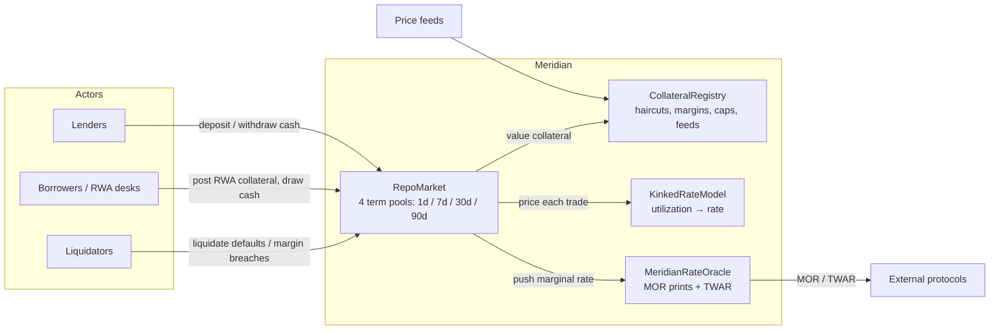

# Meridian — the on-chain repo market for tokenized assets

Meridian is a fixed-term, overcollateralized repo market where tokenized
real-world assets (treasury fund shares, private credit, and other RWAs) are
financed against stablecoin cash — and where every trade prints to an
on-chain benchmark rate, **MOR (the Meridian Overnight Rate)**.

TradFi's largest market is repo (~$4–5T/day): instant liquidity against
high-quality collateral, priced by term. Tokenized RWAs have the collateral
but not the market — redemption windows of days to months break
composability. Meridian closes that gap:

- **Holders of tokenized assets** get block-speed cash against their
  positions instead of waiting out an issuer's redemption queue.
- **Stablecoin lenders** get term-priced, collateralized yield — the
  closest thing on-chain to a risk-free curve.
- **Everyone else** gets MOR: a manipulation-resistant, time-weighted
  reference rate that other protocols can price loans, funding, and
  structured products against.

## Architecture



| Contract | Role |
|---|---|
| `RepoMarket` | Core engine: term pools, repo lifecycle (open → roll → close), margin maintenance, liquidation, fee accrual |
| `CollateralRegistry` | Governance-listed collateral with per-issuer advance rates (haircuts), maintenance margins, liquidation penalties, supply caps, and price feeds |
| `KinkedRateModel` | Per-term utilization curve that prices every repo at the pool's marginal rate |
| `MeridianRateOracle` | Cumulative rate-time accumulator (TWAP-style) publishing MOR and time-weighted average rates per term |

## How a repo works here

1. A lender deposits USDC into a term pool (overnight, 7d, 30d, or 90d) and
   receives pro-rata shares. Idle cash is withdrawable any time; lent
   principal returns as repos unwind.
2. A borrower posts registered collateral and draws cash. The rate is the
   pool's marginal rate at post-trade utilization, **fixed for the term**
   (bullet repayment; pro-rata interest on early close).
3. At maturity the borrower repays or rolls at the then-current rate. Past
   maturity a late-fee rate accrues; past maturity + 1 day grace the repo is
   in default.
4. If collateral value drops below the maintenance margin — or the repo
   defaults — anyone can liquidate: cover the debt, receive collateral at a
   small discount. Shortfalls are socialized to the pool (never to other
   pools); the protocol takes no fee on a loss.
5. Every action that moves a pool's utilization pushes the pool's marginal
   rate to the oracle. The overnight print is MOR; `twar(term, window)`
   gives the time-weighted benchmark.

## Quickstart

```bash
npm install
npx hardhat test          # 29 tests: units, lifecycle, liquidation, benchmark
npx hardhat run scripts/demo.js   # simulate a week in the market
npx hardhat run scripts/deploy.js # deploy (mocks auto-deployed on local nets)
```

> Note: compilation is configured to use the solc-js compiler bundled in the
> `solc` npm package (see `hardhat.config.js`), so it works with no network
> access to `binaries.soliditylang.org`.

## Repository layout

```
contracts/
  RepoMarket.sol            core market
  CollateralRegistry.sol    collateral listing + risk params
  KinkedRateModel.sol       utilization-based pricing
  MeridianRateOracle.sol    MOR benchmark + TWAR
  interfaces/               minimal external interfaces
  mocks/                    test/demo assets and feeds
scripts/
  deploy.js                 full-stack deployment
  demo.js                   end-to-end market simulation
test/                       29 tests across 3 suites
docs/
  DESIGN.md                 mechanism spec, risk framework, roadmap
```

## Status & security

This is a v1 protocol implementation: complete, tested, and un-audited.
Do not deploy to mainnet with real funds without an audit. Known design
boundaries and the trust model are documented in
[docs/DESIGN.md](docs/DESIGN.md).
